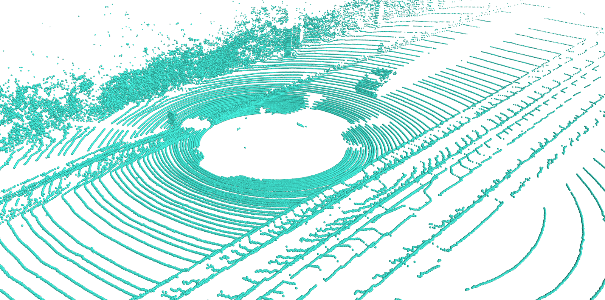
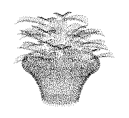
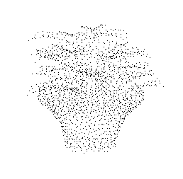
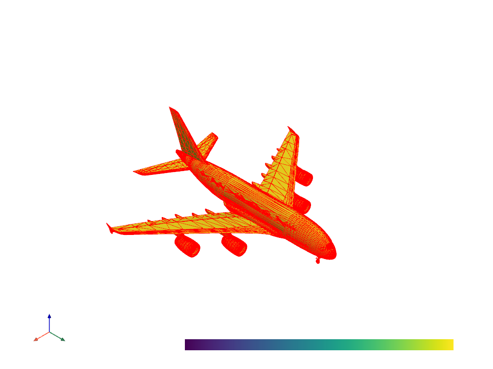
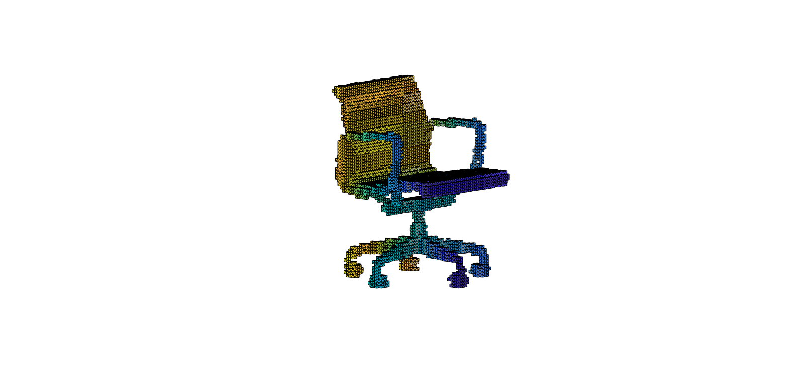

# Point Cloud ToolBox

This point cloud processing tool library can be used to process point clouds, 3d meshes, and voxels. Our toolbox not only supports single file processing, but also batch processing.

All operations have been encapsulated and can be run directly on the command line. The basic operations of the current toolbox support running on windows and linux systems, but some operations, such as point cloud upsampling, require a gpu operating environment, so currently it can only be run on linux systems. Please refer to the **usage** to learn how to use our point cloud toolbox.

## Environment

Our code has passed the test on windows10 and ubuntu18.04. The python version we use is 3.7.5 and the cuda version is 10.0. Before running our code, you need to install some dependent libraries as followed. In order to facilitate the installation environment, you can use the command: 
```shell script
pip install -r requirements.txt
```
```markdown
Dependent packages:
- scipy==1.6.2
- torch==1.4.0+cu100
- openmesh==1.1.6
- open3d==0.13.0
- plyfile==0.7.4
- numpy==1.21.2
- vtk==8.2.0
- python-pcl==0.3.0rc1
- pyntcloud==0.1.5
- mayavi==4.7.1+vtk82
- pyvista==0.31.3
```

It is noticed that package **python-pcl** is not easy to install. You can refer to [here](./docs/python-pcl) for more details.

## Done
### Point Cloud
- [x] format conversion (pointcloud->pointcloud)  
    - [x] pcd -> xyz / pts / txt / csv / ply
    - [x] las -> pcd / xyz / pts / ply / txt / csv
    - [x] ply -> pcd / xyz / pts / txt / csv   
    - [x] xyz -> pcd / pts / ply / txt / csv
    - [x] pts -> pcd / xyz / ply / txt / csv
    - [x] txt -> pcd / ply / xyz / pts
- [x] point cloud voxelization (pointcloud->voxel grid)
    - [x] pcd / ply / pts / txt / xyz -> binvox
- [x] downsampling
    - [x] farthest point sampling(FPS)
    - [x] random sampling
    - [x] uniform sampling
    - [x] voxel sampling
- [x] upsampling
    - [x] Meta-PU [[published in TVCG2021](./PU/Meta-PU/README.md)]
- [x] filtering
    - [x] PassThrough Filter
    - [x] VoxelGrid Filter
    - [x] project_inliers Filter
    - [x] remove_outliers Filter
    - [x] statistical_removal Filter
- [x] registration
    - [x] ICP
    - [x] RANSAC
- [x] 3D reconstruction (pointcloud->mesh)
    - [x] poisson surface reconstruction
    - [x] ball pivoting
    - [x] supported format:
        - [x] pcd -> off / ply / obj / stl
        - [x] xyz -> off / ply / obj / stl
        - [x] pts -> off / ply / obj / stl
        - [x] txt -> off / ply / obj / stl
- [x] visualization
    - [x] pcd / xyz / pts / ply / las / txt

### 3d Mesh
- [x] format conversion (mesh->mesh)
    - [x] ply -> obj / stl / off
    - [x] obj -> ply / off / stl
    - [x] off -> ply / obj / stl
- [x] down sampling into point cloud
    - [x] poisson disk sampling
    - [x] uniform sampling
- [x] mesh filtering
    - [x] Taubin filter
    - [x] Laplacian smooth
    - [x] simple neighbour average
- [x] Calculate the surface area and volume of 3D Mesh
- [x] Convert 3d mesh to voxel grid
    - [x] obj -> binvox / hips / mira / vtk / msh
    - [x] off -> binvox / hips / mira / vtk / msh
    - [x] dxf -> binvox / hips / mira / vtk / msh
    - [x] ply -> binvox / hips / mira / vtk / msh
    - [x] stl -> binvox / hips / mira / vtk / msh
- [x] mesh subdivision
    - [x] loop
    - [x] midpoint
- [x] 3d mesh visualization
    - [x] ply / vtk / stl / obj / off / msh

### voxel
- [x] voxel visualization
    - [x] binvox / mira

## Todo
### Point Cloud
- [ ] Basic operation of point cloud
    - [x] shuffle / jitter / rotate / shift / add Gaussian noise
    - [ ] generate graph
        - [ ] knn
        - [ ] ball query
- [ ] metrics calculation
    - [ ] Chamfer Distance(CD)
    - [ ] Hausdorff Distance(HD)
    - [ ] Earth Mover Distance(EMD)
    - [ ] P2F
- [ ] completion
- [ ] shape classification
- [ ] segmentation
- [ ] object detection


## Usage
Nearly all commands can be found in [**run.sh**](./run.sh). More details will be introduced in this section.

### 1. Point Cloud processing
#### 1.1 format conversion
This module can batch convert one point cloud format into another point cloud format. 

- supported point cloud format: **pcd**, **las**, **ply**, **xyz**, **pts**, **txt**.
- supported format conversion mode
  - [x] pcd -> xyz / pts / txt / csv / ply
  - [x] las -> pcd / xyz / pts / ply / txt / csv
  - [x] ply -> pcd / xyz / pts / txt / csv   
  - [x] xyz -> pcd / pts / ply / txt / csv
  - [x] pts -> pcd / xyz / ply / txt / csv
  - [x] txt -> pcd / ply / xyz / pts
- parameters:
  - mode: represents the type of application, varies from [0, 13], here mode=0
  - input_dir: the path of input point cloud
  - input_format: the format of input point cloud
  - output_dir: the path of output point cloud
  - output_format: the format of output point cloud
- example(*.pcd*->*.xyz*):
```shell script
python pc_factory.py --mode 0 --input_dir ../data/test --output_dir ../result/pcd_2_xyz/ --input_format pcd --output_format xyz
```

#### 1.2 convert point cloud into 3d mesh
This module can batch convert one point cloud format into another 3d mesh format. The technology used here is 3D reconstruction. Refer to *open3d*, Poisson surface reconstruction and ball pivoting reconstruction are implemented in this toolbox. 

- supported mesh format: **off**, **ply**, **obj**, **stl**
- supported format conversion mode
  - [x] pcd -> off / ply / obj / stl
  - [x] xyz -> off / ply / obj / stl
  - [x] pts -> off / ply / obj / stl
  - [x] txt -> off / ply / obj / stl
- parameters:
  - mode: represents the type of application, varies from [0, 13], here mode=11
  - input_dir: the path of input point cloud
  - input_format: the format of input point cloud
  - output_dir: the path of output 3d mesh
  - output_format: the format of output 3d mesh
  - constructor: type of 3d reconstruction, [*poisson, ball_pivoting*] are available
  - depth: the depth used in poisson surface reconstruction
- example 
```shell script
# poisson surface reconstruction
python pc_factory.py --mode 11 --input_dir ../data/test --output_dir ../result/3d_poisson/ --input_format pcd --output_format off --constructor poisson --depth 9
# ball pivoting
python pc_factory.py --mode 11 --input_dir ../data/test --output_dir ../result/ball_pivoting/ --input_format pcd --output_format off --constructor ball_pivoting
```
For more details about parameters, you can find in [here](./lib/configs.py).

#### 1.3 convert point cloud into voxel
This module can convert point cloud into **binvox** voxel grid. This is implemented by using *pyntcloud*
and script [*binvox_rw.py*](./common/binvox_rw.py).

- supported format conversion mode
  - [x] pcd / ply / pts / txt / xyz -> binvox
- parameters:
  - mode: represents the type of application, varies from [0, 13], here mode=10
  - input_dir: the path of input point cloud
  - input_format: the format of input point cloud
  - output_dir: the path of output voxel grid
  - output_format: the format of output voxel grid, only *binvox* can be used 
  - input_file: the file of input point cloud
  - voxel: the size of voxel, type: *int*
- example
```shell script
# batch processing
python pc_factory.py --mode 10 --input_dir ../data/test --output_dir ../result/pc_voxel_grid/ --input_format pcd --output_format binvox --voxel 64
# single processing
python PointCloud2Voxel.py --mode 10 --input_file ../data/test/plant_0312.xyz --output_dir ../result/pc_voxel_grid/ --output_format binvox --voxel 64
```

#### 1.4 point cloud visualization
Our toolbox uses *Mayavi* to visualize the point cloud. The script can be found in [here](./common/pointcloud_vis.py). 
Some parameters (*fgcolor*, *colormap*, *scale_factor*, *sphere*) can be modified according to your own situation.

- default configuration
  - fgcolor: (0.25, 0.88, 0.81), which is cyan-blue
  - colormap: spectral
  - scale_factor: 0.1
  - mode: sphere
- supported point cloud format
  - [x] pcd / xyz / pts / ply / las / txt
- parameters:
  - mode: represents the type of application, varies from [0, 13], here mode=12
  - input_file: the file of input point cloud
  - scale_factor: the size of every showed point, type:*float*
- example
```shell script
python pointcloud_vis.py --mode 12 --input_file ../data/test/000001.pcd --scale_factor 0.1
```
The result is shown:



Besides, you can export *eps, pdf, png, jpg and other binary format* using Mayavi.

#### 1.5 point cloud downsampling
This module can convert dense point cloud into sparse one. The input is dense point cloud, whereas the output is sparse point cloud with same extension.
Here we implemented *4* point cloud downsampling algorithms: [*fps*](./common/fps.py), *random downsampling*,
*uniform downsampling* and *voxel downsampling*. The [*fps*](./common/fps.py) is also called farthest point sampling, which needs to use *pytorch* to speed up.

- supported point cloud format
  - [x] pcd / xyz / pts / ply / txt
- parameters:
  - mode: represents the type of application, varies from [0, 13], here mode=5
  - input_dir: the path of input point cloud
  - input_format: the format of input point cloud
  - output_dir: the path of output voxel grid 
  - down_sampler: the downsampling algorithm, [fps, random, uniform, voxel]
  - point_num: the number of output point, used in *fps* and *random downsampling*
  - k: choose 1 point every k points, used in *uniform downsampling*
  - voxel_size: the size of voxel, type: *float*, used in *voxel downsampling*
- example
```shell script
# FPS(recommended)
python pc_factory.py --mode 5 --down_sampler fps --point_num 2048 --input_dir ../data/test --output_dir ../result/downsample/fps/ --input_format ply
# random downsampling
python pc_factory.py --mode 5 --down_sampler random --point_num 2048 --input_dir ../data/test --output_dir ../result/downsample/random/ --input_format ply
# uniform downsampling
python pc_factory.py --mode 5 --down_sampler uniform --k 4 --input_dir ../data/test --output_dir ../result/downsample/uniform/ --input_format ply
# voxel downsampling
python pc_factory.py --mode 5 --down_sampler voxel --voxel_size 0.5 --input_dir ../data/test --output_dir ../result/downsample/voxel/ --input_format ply
```

The result of *fps* is shown. The input point has 8192 points, whereas output points has 2048 points.

The input:



The *fps* output:



Since uniform sampling and voxel sampling cannot get the result of the specified number of points, and random sampling may lose semantic information of the original point cloud
. So it is recommended to use [*fps*](./common/fps.py).

#### 1.6 point cloud upsampling
This module can convert sparse point cloud into dense one. Here we use *Meta-PU* to sample point cloud with arbitrary upsampling rate.
Pretrained models were provided in our toolbox, you can find them in [*here*](./PU/Meta-PU/model/new). This application requires *CUDA* environment. You 
can't run this application on Windows10 unless you have *CUDA* environment. It is recommended
to run it on Unix platform. More details can be found in [*./PU/Meta-PU/README.md*](./PU/Meta-PU/README.md).

- supported point cloud format: *xyz*
- parameters:
  - mode: represents the type of application, varies from [0, 13], here mode=9
  - input_dir: the path of input point cloud
  - input_format: the format of input point cloud, only xyz is supported
  - pu_model: point cloud upsampling model, only *Meta-PU* is available
  - scale: the upsampling rate, type: *float*
- example
```shell script
python pc_factory.py --mode 9 --input_dir ../PU/Meta-PU/model/data/all_testset/4/input --input_format xyz --pu_model Meta-PU --scale 5.5
```

In the script [*pc_factory.py*](./lib/pc_factory.py), we have encapsulated the Meta-PU model. You can directly use the above command to complete upsampling, or refer to [*./PU/Meta-PU/README.md*](./PU/Meta-PU/README.md) to run.

#### 1.7 point cloud filtering
This module achieves point cloud filtering by *python-pcl*. Five filtering algorithms can be used here:
*PassThroughFilter*, *VoxelGrid*, *project_inliers*, *remove_outlier*, *statistical_removal*. The script of point cloud filtering is
[*here*](./common/filter.py).

- supported point cloud format
  - [x] pcd / xyz / pts / ply / txt
- parameters:
  - mode: represents the type of application, varies from [0, 13], here mode=3
  - filter: the type of filter, [*PassThroughFilter*, *VoxelGrid*, *project_inliers*, *remove_outlier*, *statistical_removal* ] are available
  - input_dir: the path of input point cloud
  - output_dir: the path of output voxel grid
  - input_format: the format of input point cloud
  - upper_limit: upper value used in *PassThroughFilter*, type:*float*
  - voxel_size: the size of voxel, used in *VoxelGrid*, type: *float*,
  - removal: the removal type, [*radius, condition*] are available
  - radius: search radius for RadiusOutlier, used in *remove_outlier*, type:*float*
  - min_neighbor: min neighbors in radius for RadiusOutlier, used in *remove_outlier*, type:*int*
  - std_dev: used in *Statistical Outlier Removal filter*, type:*float*
- example
```shell script
# PassThroughFilter
python pc_factory.py --mode 3 --filter PassThroughFilter --upper_limit 5 --input_dir ../data/test --output_dir ../result/filter/PassThroughFilter/ --input_format pcd
# VoxelGrid(recommended)
python pc_factory.py --mode 3 --filter VoxelGridFilter --voxel_size 0.1 --input_dir ../data/test --output_dir ../result/filter/VoxelGridFilter/ --input_format pcd
# project_inliers
python pc_factory.py --mode 3 --filter project_inliers --input_dir ../data/test --output_dir ../result/filter/project_inliers/ --input_format pcd
# remove_outlier
python pc_factory.py --mode 3 --filter remove_outliers --removal radius --radius 5.0 --min_neighbor 3 --input_dir ../data/test --output_dir ../result/filter/remove_outlier/ --input_format pcd
python pc_factory.py --mode 3 --filter remove_outliers --removal condition --radius 5.0 --min_neighbor 3 --input_dir ../data/test --output_dir ../result/filter/remove_outlier/ --input_format pcd
# statistical_removal
python pc_factory.py --mode 3 --filter statistical_removal --std_dev 1.0 --input_dir ../data/test --output_dir ../result/filter/statistical_removal/ --input_format pcd
```

Since the parameter *upper_limit*, *radius*, *min_neighbor*, *std_dev* are not easy to adjust. So it is recommended to use *VoxelGrid Filter*.

#### 1.8 point cloud registration
This module can register the original point cloud and target point cloud, and return the transformation matrix. The traditional [*ICP*](./common/iterative_closest_point.py) and [*RANSAC*](./common/RANSAC.py) registration algorithms are achieved here.

- supported point cloud format: [*pcd*, *ply*, *xyz*]
- parameters:
  - s_file: source point cloud file
  - t_file: target point cloud file
- example
```shell script
cd ./common
# ICP
python iterative_closest_point.py --s_file ../data/registration/bun000.ply --t_file ../data/registration/bun045.ply
# RANSAC
python RANSAC.py --s_file ../data/registration/bun000.ply --t_file ../data/registration/bun045.ply
```

### 2. Mesh processing
#### 2.1 format conversion
This module can batch convert one mesh format into another mesh format. 

- supported mesh format: **ply**, **obj**, **stl**, **off**.
- supported format conversion mode
  - [x] ply -> obj / stl / off
  - [x] obj -> ply / off / stl
  - [x] off -> ply / obj / stl
- parameters:
  - mode: represents the type of application, varies from [0, 13], here mode=1
  - input_dir: the path of input mesh
  - input_format: the format of input mesh
  - output_dir: the path of output mesh
  - output_format: the format of output mesh
- example(*.ply*->*.obj*):
```shell script
python mesh_factory.py --mode 1 --input_dir ../data/test --output_dir ../result/ply_2_obj/ --input_format ply --output_format obj
```

#### 2.2 convert mesh into point cloud
This module can convert 3d mesh into point cloud by *poisson disk sampling* or *uniformly sampling*.

- supported mesh format: **off**, **ply**, **obj**, **stl**
- supported format conversion mode
  - [x] off -> ply / xyz / pcd
  - [x] ply -> xyz / pcd
  - [x] obj -> ply / xyz / pcd
  - [x] stl -> ply / xyz / pcd
- parameters:
  - mode: represents the type of application, varies from [0, 13], here mode=2
  - input_dir: the path of input mesh
  - input_format: the format of input mesh
  - output_dir: the path of output point cloud
  - output_format: the format of output point cloud
  - sampler: type of sampler, [*poisson_disk_sampling, uniform_sampling*] are available
  - point_num: the number of output point, type:*int*
  - factor: Factor for the initial uniformly sampled PointCloud. This init PointCloud is used for sample elimination. type:*int*
- example 
```shell script
# poisson disk sampling
# off->xyz
python mesh_factory.py --mode 2 --input_dir ../data/test --output_dir ../result/possion/  --input_format off --output_format xyz --sampler poisson_disk_sampling --point_num 1024 --factor 5

# uniform sampling
# off->xyz
python mesh_factory.py --mode 2 --input_dir ../data/test --output_dir ../result/uniform/  --input_format off --output_format xyz --sampler uniform_sampling --point_num 1024
```

#### 2.3 convert mesh into voxel
This module can convert mesh into voxel grid. This is implemented by using [*binvox*](./vox/README.md).

- supported format conversion mode
  - [x] obj -> binvox / hips / mira / vtk / msh
  - [x] off -> binvox / hips / mira / vtk / msh
  - [x] dxf -> binvox / hips / mira / vtk / msh
  - [x] ply -> binvox / hips / mira / vtk / msh
  - [x] stl -> binvox / hips / mira / vtk / msh
- parameters:
  - mode: represents the type of application, varies from [0, 13], here mode=7
  - input_dir: the path of input point cloud
  - input_format: the format of input point cloud
  - output_dir: the path of output voxel grid
  - output_format: the format of output voxel grid, [*binvox, hips, mira, vtk, msh*] are available 
  - d: voxel grid size, max:1024, type:*int*
- example
```shell script
python voxel_factory.py --mode 7 --input_dir ../data/test --output_dir ../result/mesh_2_voxel/ply2binvox/ --input_format ply --output_format binvox --d 256
```

It is noticed that the upper value of parameter *d* is *1024*. The binvox file can be previewed by [*viewvox*](./vox/linux/viewvox). The linux version and Windows version are provided in [*./vox*](./vox).
You can open vtk file using software [*paraview*](https://www.paraview.org/), open msh file using software [*gmsh*](https://gmsh.info/).

#### 2.4 mesh visualization
Here we use *pyvista* to visualize 3d mesh. The script can be found in [*here*](./common/mesh_vis.py).

- supported mesh format
  - [x] ply / vtk / stl / obj / off / msh
- parameters:
  - mode: represents the type of application, varies from [0, 13], here mode=13
  - input_file: the file of input mesh
  - screenshot: The save path of the screenshot
- example
```shell script
python mesh_vis.py --mode 13 --input_file ../data/test/A380.obj --screenshot ../result/snapshot/
```

The result is shown:



#### 2.5 mesh filtering
This module achieves mesh filtering by *open3d*. Three filtering algorithms can be used here:
*taubin filter*, *Laplacian smooth filter*, *simple neighbour average*. 

- supported mesh format
  - [x] ply / obj / stl
- parameters:
  - mode: represents the type of application, varies from [0, 13], here mode=4
  - mesh_filter: the type of filter, [*taubin*, *laplacian*, *neighbour*] are available
  - input_dir: the path of input mesh
  - output_dir: the path of output mesh
  - input_format: the format of input mesh
- example
```shell script
# taubin filter
python mesh_factory.py --mode 4 --mesh_filter taubin --input_dir ../data/test --output_dir ../result/filter/taubin/ --input_format ply
# Laplacian smooth filter
python mesh_factory.py --mode 4 --mesh_filter laplacian --input_dir ../data/test --output_dir ../result/filter/laplacian/ --input_format ply
# simple neighbour average
python mesh_factory.py --mode 4 --mesh_filter neighbour --input_dir ../data/test --output_dir ../result/filter/simple/ --input_format ply
```

#### 2.6 mesh subdivision
In mesh subdivision we divide each triangle into a number of smaller triangles. More details can refer to [*here*](http://www.open3d.org/docs/release/tutorial/geometry/mesh.html#Mesh-subdivision).

- supported mesh format
  - [x] ply / obj / stl
- parameters:
  - mode: represents the type of application, varies from [0, 13], here mode=6
  - subdivision_type: the type of mesh subdivision, [*loop*, *midpoint*] are available
  - iteration: how many times 3d mesh subdivision should be repeated. Too big value is not suitable. 
  - input_dir: the path of input mesh
  - output_dir: the path of output mesh
  - input_format: the format of input mesh
- example
```shell script
# loop
python mesh_factory.py --mode 6 --subdivision_type loop --iteration 1 --input_dir ../data/test --output_dir ../result/subdivision/loop/ --input_format ply
# midpoint
python mesh_factory.py --mode 6 --subdivision_type midpoint --iteration 1 --input_dir ../data/test --output_dir ../result/subdivision/midpoint/ --input_format ply
```

#### 2.7 Calculate the surface area and volume

This module can calculate the approximate value of surface area and volume of 3d mesh. Here *vtk* and *open3d* are used. The script can be 
found in [*SurfaceAreaVolume.py*](./lib/SurfaceAreaVolume.py).

- supported mesh format
  - [x] ply / obj / off / stl
- parameters:
  - input_dir: the path of input mesh
  - input_format: the format of input mesh
- Returns:
  - None. You can find the result of surface area and volume in the shell.
- example
```shell script
python SurfaceAreaVolume.py --input_dir ../data/test --input_format ply
```

### 3. voxel grid processing
#### 3.1 voxel visualization
Here we use [*viewvox*](./vox/) to visualize the voxel grid. 

- supported mesh format
  - [x] binvox / mira
- parameters:
  - mode: represents the type of application, varies from [0, 13], here mode=8
  - input_file: the file of input voxel
- example
```shell script
python voxel_vis.py --mode 8 --input_file ../result/mesh_2_voxel/ply2binvox/14.binvox
python voxel_vis.py --mode 8 --input_file ../result/mesh_2_voxel/ply2mira/14.mira
```

Regrettably, *viewvox* does not support exporting images. Therefore, you can try to read the binvox file using the script [*binvox_rw.py*](./common/binvox_rw.py) to get the data and then use matlab or matplotlib to show binvox. The matlab scripts are provided [*here*](./docs/export_voxel_to_png/). By using this script, I get the image:

 

## Reference
```markdown
@article{Ye2021MetaPUAA,
  title={Meta-PU: An Arbitrary-Scale Upsampling Network for Point Cloud},
  author={S. Ye and Dongdong Chen and Songfang Han and Ziyu Wan and Jing Liao},
  journal={IEEE transactions on visualization and computer graphics},  
  year={2021},
  volume={PP}
}

@article{nooruddin03,
  author = {Fakir S. Nooruddin and Greg Turk},
  title = {Simplification and Repair of Polygonal Models Using Volumetric Techniques},
  journal = {IEEE Transactions on Visualization and Computer Graphics},
  volume = {9},
  number = {2},
  pages = {191--205},
  year = {2003}
}

@Misc{binvox,
  author = {Patrick Min},
  title =  {binvox},
  howpublished = {{\tt http://www.patrickmin.com/binvox} or {\tt https://www.google.com/search?q=binvox}},
  year =  {2004 - 2019},
  note = {Accessed: yyyy-mm-dd}
}

@Misc{meshconv,
  author = {Patrick Min},
  title =  {meshconv},
  howpublished = {{\tt http://www.patrickmin.com/meshconv} or {\tt https://www.google.com/search?q=meshconv}},
  year =  {1997 - 2019},
  note = {Accessed: yyyy-mm-dd}
}
```

**To be continued...**

    
   